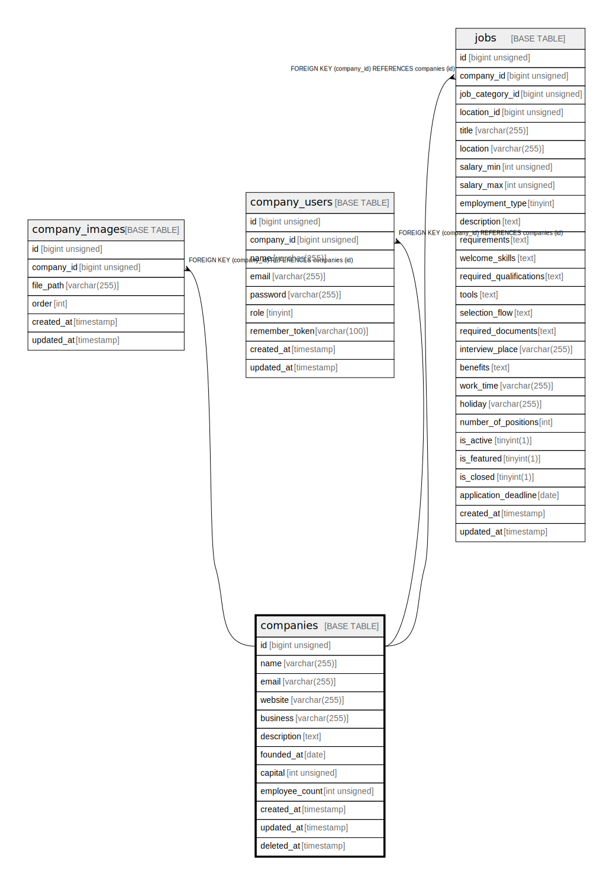

# companies

## Description

<details>
<summary><strong>Table Definition</strong></summary>

```sql
CREATE TABLE `companies` (
  `id` bigint unsigned NOT NULL AUTO_INCREMENT,
  `name` varchar(255) COLLATE utf8mb4_unicode_ci NOT NULL,
  `email` varchar(255) COLLATE utf8mb4_unicode_ci NOT NULL,
  `website` varchar(255) COLLATE utf8mb4_unicode_ci DEFAULT NULL,
  `business` varchar(255) COLLATE utf8mb4_unicode_ci DEFAULT NULL,
  `description` text COLLATE utf8mb4_unicode_ci,
  `founded_at` date DEFAULT NULL,
  `capital` int unsigned DEFAULT NULL,
  `employee_count` int unsigned DEFAULT NULL,
  `created_at` timestamp NULL DEFAULT NULL,
  `updated_at` timestamp NULL DEFAULT NULL,
  `deleted_at` timestamp NULL DEFAULT NULL,
  PRIMARY KEY (`id`)
) ENGINE=InnoDB AUTO_INCREMENT=[Redacted by tbls] DEFAULT CHARSET=utf8mb4 COLLATE=utf8mb4_unicode_ci
```

</details>

## Columns

| Name | Type | Default | Nullable | Extra Definition | Children | Parents | Comment |
| ---- | ---- | ------- | -------- | ---------------- | -------- | ------- | ------- |
| id | bigint unsigned |  | false | auto_increment | [company_images](company_images.md) [company_users](company_users.md) [jobs](jobs.md) |  |  |
| name | varchar(255) |  | false |  |  |  |  |
| email | varchar(255) |  | false |  |  |  |  |
| website | varchar(255) |  | true |  |  |  |  |
| business | varchar(255) |  | true |  |  |  |  |
| description | text |  | true |  |  |  |  |
| founded_at | date |  | true |  |  |  |  |
| capital | int unsigned |  | true |  |  |  |  |
| employee_count | int unsigned |  | true |  |  |  |  |
| created_at | timestamp |  | true |  |  |  |  |
| updated_at | timestamp |  | true |  |  |  |  |
| deleted_at | timestamp |  | true |  |  |  |  |

## Constraints

| Name | Type | Definition |
| ---- | ---- | ---------- |
| PRIMARY | PRIMARY KEY | PRIMARY KEY (id) |

## Indexes

| Name | Definition |
| ---- | ---------- |
| PRIMARY | PRIMARY KEY (id) USING BTREE |

## Relations



---

> Generated by [tbls](https://github.com/k1LoW/tbls)
