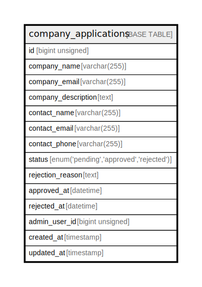

# company_applications

## Description

<details>
<summary><strong>Table Definition</strong></summary>

```sql
CREATE TABLE `company_applications` (
  `id` bigint unsigned NOT NULL AUTO_INCREMENT,
  `company_name` varchar(255) COLLATE utf8mb4_unicode_ci NOT NULL,
  `company_email` varchar(255) COLLATE utf8mb4_unicode_ci NOT NULL,
  `company_description` text COLLATE utf8mb4_unicode_ci,
  `contact_name` varchar(255) COLLATE utf8mb4_unicode_ci NOT NULL,
  `contact_email` varchar(255) COLLATE utf8mb4_unicode_ci NOT NULL,
  `contact_phone` varchar(255) COLLATE utf8mb4_unicode_ci DEFAULT NULL,
  `status` enum('pending','approved','rejected') COLLATE utf8mb4_unicode_ci NOT NULL DEFAULT 'pending',
  `rejection_reason` text COLLATE utf8mb4_unicode_ci,
  `approved_at` datetime DEFAULT NULL,
  `rejected_at` datetime DEFAULT NULL,
  `admin_user_id` bigint unsigned DEFAULT NULL,
  `created_at` timestamp NULL DEFAULT NULL,
  `updated_at` timestamp NULL DEFAULT NULL,
  PRIMARY KEY (`id`)
) ENGINE=InnoDB DEFAULT CHARSET=utf8mb4 COLLATE=utf8mb4_unicode_ci
```

</details>

## Columns

| Name | Type | Default | Nullable | Extra Definition | Children | Parents | Comment |
| ---- | ---- | ------- | -------- | ---------------- | -------- | ------- | ------- |
| id | bigint unsigned |  | false | auto_increment |  |  |  |
| company_name | varchar(255) |  | false |  |  |  |  |
| company_email | varchar(255) |  | false |  |  |  |  |
| company_description | text |  | true |  |  |  |  |
| contact_name | varchar(255) |  | false |  |  |  |  |
| contact_email | varchar(255) |  | false |  |  |  |  |
| contact_phone | varchar(255) |  | true |  |  |  |  |
| status | enum('pending','approved','rejected') | pending | false |  |  |  |  |
| rejection_reason | text |  | true |  |  |  |  |
| approved_at | datetime |  | true |  |  |  |  |
| rejected_at | datetime |  | true |  |  |  |  |
| admin_user_id | bigint unsigned |  | true |  |  |  |  |
| created_at | timestamp |  | true |  |  |  |  |
| updated_at | timestamp |  | true |  |  |  |  |

## Constraints

| Name | Type | Definition |
| ---- | ---- | ---------- |
| PRIMARY | PRIMARY KEY | PRIMARY KEY (id) |

## Indexes

| Name | Definition |
| ---- | ---------- |
| PRIMARY | PRIMARY KEY (id) USING BTREE |

## Relations



---

> Generated by [tbls](https://github.com/k1LoW/tbls)
