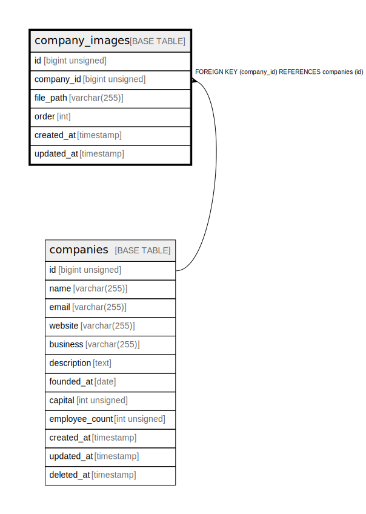

# company_images

## Description

<details>
<summary><strong>Table Definition</strong></summary>

```sql
CREATE TABLE `company_images` (
  `id` bigint unsigned NOT NULL AUTO_INCREMENT,
  `company_id` bigint unsigned NOT NULL,
  `file_path` varchar(255) COLLATE utf8mb4_unicode_ci NOT NULL,
  `order` int NOT NULL DEFAULT '1',
  `created_at` timestamp NULL DEFAULT NULL,
  `updated_at` timestamp NULL DEFAULT NULL,
  PRIMARY KEY (`id`),
  UNIQUE KEY `company_images_company_id_order_unique` (`company_id`,`order`),
  CONSTRAINT `company_images_company_id_foreign` FOREIGN KEY (`company_id`) REFERENCES `companies` (`id`) ON DELETE CASCADE
) ENGINE=InnoDB DEFAULT CHARSET=utf8mb4 COLLATE=utf8mb4_unicode_ci
```

</details>

## Columns

| Name | Type | Default | Nullable | Extra Definition | Children | Parents | Comment |
| ---- | ---- | ------- | -------- | ---------------- | -------- | ------- | ------- |
| id | bigint unsigned |  | false | auto_increment |  |  |  |
| company_id | bigint unsigned |  | false |  |  | [companies](companies.md) |  |
| file_path | varchar(255) |  | false |  |  |  |  |
| order | int | 1 | false |  |  |  |  |
| created_at | timestamp |  | true |  |  |  |  |
| updated_at | timestamp |  | true |  |  |  |  |

## Constraints

| Name | Type | Definition |
| ---- | ---- | ---------- |
| company_images_company_id_foreign | FOREIGN KEY | FOREIGN KEY (company_id) REFERENCES companies (id) |
| company_images_company_id_order_unique | UNIQUE | UNIQUE KEY company_images_company_id_order_unique (company_id, order) |
| PRIMARY | PRIMARY KEY | PRIMARY KEY (id) |

## Indexes

| Name | Definition |
| ---- | ---------- |
| PRIMARY | PRIMARY KEY (id) USING BTREE |
| company_images_company_id_order_unique | UNIQUE KEY company_images_company_id_order_unique (company_id, order) USING BTREE |

## Relations



---

> Generated by [tbls](https://github.com/k1LoW/tbls)
