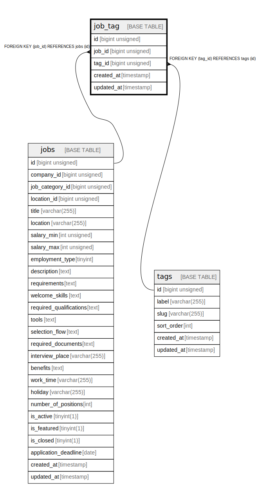

# job_tag

## Description

<details>
<summary><strong>Table Definition</strong></summary>

```sql
CREATE TABLE `job_tag` (
  `id` bigint unsigned NOT NULL AUTO_INCREMENT,
  `job_id` bigint unsigned NOT NULL,
  `tag_id` bigint unsigned NOT NULL,
  `created_at` timestamp NULL DEFAULT NULL,
  `updated_at` timestamp NULL DEFAULT NULL,
  PRIMARY KEY (`id`),
  KEY `job_tag_job_id_foreign` (`job_id`),
  KEY `job_tag_tag_id_foreign` (`tag_id`),
  CONSTRAINT `job_tag_job_id_foreign` FOREIGN KEY (`job_id`) REFERENCES `jobs` (`id`) ON DELETE CASCADE,
  CONSTRAINT `job_tag_tag_id_foreign` FOREIGN KEY (`tag_id`) REFERENCES `tags` (`id`) ON DELETE CASCADE
) ENGINE=InnoDB AUTO_INCREMENT=[Redacted by tbls] DEFAULT CHARSET=utf8mb4 COLLATE=utf8mb4_unicode_ci
```

</details>

## Columns

| Name | Type | Default | Nullable | Extra Definition | Children | Parents | Comment |
| ---- | ---- | ------- | -------- | ---------------- | -------- | ------- | ------- |
| id | bigint unsigned |  | false | auto_increment |  |  |  |
| job_id | bigint unsigned |  | false |  |  | [jobs](jobs.md) |  |
| tag_id | bigint unsigned |  | false |  |  | [tags](tags.md) |  |
| created_at | timestamp |  | true |  |  |  |  |
| updated_at | timestamp |  | true |  |  |  |  |

## Constraints

| Name | Type | Definition |
| ---- | ---- | ---------- |
| job_tag_job_id_foreign | FOREIGN KEY | FOREIGN KEY (job_id) REFERENCES jobs (id) |
| job_tag_tag_id_foreign | FOREIGN KEY | FOREIGN KEY (tag_id) REFERENCES tags (id) |
| PRIMARY | PRIMARY KEY | PRIMARY KEY (id) |

## Indexes

| Name | Definition |
| ---- | ---------- |
| job_tag_job_id_foreign | KEY job_tag_job_id_foreign (job_id) USING BTREE |
| job_tag_tag_id_foreign | KEY job_tag_tag_id_foreign (tag_id) USING BTREE |
| PRIMARY | PRIMARY KEY (id) USING BTREE |

## Relations



---

> Generated by [tbls](https://github.com/k1LoW/tbls)
