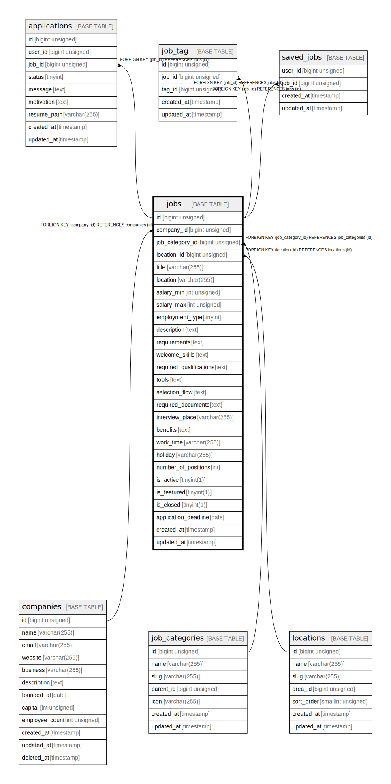

# jobs

## Description

<details>
<summary><strong>Table Definition</strong></summary>

```sql
CREATE TABLE `jobs` (
  `id` bigint unsigned NOT NULL AUTO_INCREMENT,
  `company_id` bigint unsigned NOT NULL,
  `job_category_id` bigint unsigned NOT NULL,
  `location_id` bigint unsigned DEFAULT NULL,
  `title` varchar(255) COLLATE utf8mb4_unicode_ci NOT NULL,
  `location` varchar(255) COLLATE utf8mb4_unicode_ci DEFAULT NULL,
  `salary_min` int unsigned NOT NULL,
  `salary_max` int unsigned NOT NULL,
  `employment_type` tinyint NOT NULL DEFAULT '1',
  `description` text COLLATE utf8mb4_unicode_ci NOT NULL,
  `requirements` text COLLATE utf8mb4_unicode_ci,
  `welcome_skills` text COLLATE utf8mb4_unicode_ci,
  `required_qualifications` text COLLATE utf8mb4_unicode_ci,
  `tools` text COLLATE utf8mb4_unicode_ci,
  `selection_flow` text COLLATE utf8mb4_unicode_ci,
  `required_documents` text COLLATE utf8mb4_unicode_ci,
  `interview_place` varchar(255) COLLATE utf8mb4_unicode_ci DEFAULT NULL,
  `benefits` text COLLATE utf8mb4_unicode_ci,
  `work_time` varchar(255) COLLATE utf8mb4_unicode_ci DEFAULT NULL,
  `holiday` varchar(255) COLLATE utf8mb4_unicode_ci DEFAULT NULL,
  `number_of_positions` int DEFAULT NULL,
  `is_active` tinyint(1) NOT NULL DEFAULT '1',
  `is_featured` tinyint(1) NOT NULL DEFAULT '0',
  `is_closed` tinyint(1) NOT NULL DEFAULT '0',
  `application_deadline` date DEFAULT NULL,
  `created_at` timestamp NULL DEFAULT NULL,
  `updated_at` timestamp NULL DEFAULT NULL,
  PRIMARY KEY (`id`),
  KEY `jobs_company_id_foreign` (`company_id`),
  KEY `jobs_job_category_id_foreign` (`job_category_id`),
  KEY `jobs_location_id_foreign` (`location_id`),
  CONSTRAINT `jobs_company_id_foreign` FOREIGN KEY (`company_id`) REFERENCES `companies` (`id`) ON DELETE CASCADE,
  CONSTRAINT `jobs_job_category_id_foreign` FOREIGN KEY (`job_category_id`) REFERENCES `job_categories` (`id`) ON DELETE CASCADE,
  CONSTRAINT `jobs_location_id_foreign` FOREIGN KEY (`location_id`) REFERENCES `locations` (`id`) ON DELETE SET NULL
) ENGINE=InnoDB AUTO_INCREMENT=[Redacted by tbls] DEFAULT CHARSET=utf8mb4 COLLATE=utf8mb4_unicode_ci
```

</details>

## Columns

| Name | Type | Default | Nullable | Extra Definition | Children | Parents | Comment |
| ---- | ---- | ------- | -------- | ---------------- | -------- | ------- | ------- |
| id | bigint unsigned |  | false | auto_increment | [applications](applications.md) [job_tag](job_tag.md) [saved_jobs](saved_jobs.md) |  |  |
| company_id | bigint unsigned |  | false |  |  | [companies](companies.md) |  |
| job_category_id | bigint unsigned |  | false |  |  | [job_categories](job_categories.md) |  |
| location_id | bigint unsigned |  | true |  |  | [locations](locations.md) |  |
| title | varchar(255) |  | false |  |  |  |  |
| location | varchar(255) |  | true |  |  |  |  |
| salary_min | int unsigned |  | false |  |  |  |  |
| salary_max | int unsigned |  | false |  |  |  |  |
| employment_type | tinyint | 1 | false |  |  |  |  |
| description | text |  | false |  |  |  |  |
| requirements | text |  | true |  |  |  |  |
| welcome_skills | text |  | true |  |  |  |  |
| required_qualifications | text |  | true |  |  |  |  |
| tools | text |  | true |  |  |  |  |
| selection_flow | text |  | true |  |  |  |  |
| required_documents | text |  | true |  |  |  |  |
| interview_place | varchar(255) |  | true |  |  |  |  |
| benefits | text |  | true |  |  |  |  |
| work_time | varchar(255) |  | true |  |  |  |  |
| holiday | varchar(255) |  | true |  |  |  |  |
| number_of_positions | int |  | true |  |  |  |  |
| is_active | tinyint(1) | 1 | false |  |  |  |  |
| is_featured | tinyint(1) | 0 | false |  |  |  |  |
| is_closed | tinyint(1) | 0 | false |  |  |  |  |
| application_deadline | date |  | true |  |  |  |  |
| created_at | timestamp |  | true |  |  |  |  |
| updated_at | timestamp |  | true |  |  |  |  |

## Constraints

| Name | Type | Definition |
| ---- | ---- | ---------- |
| jobs_company_id_foreign | FOREIGN KEY | FOREIGN KEY (company_id) REFERENCES companies (id) |
| jobs_job_category_id_foreign | FOREIGN KEY | FOREIGN KEY (job_category_id) REFERENCES job_categories (id) |
| jobs_location_id_foreign | FOREIGN KEY | FOREIGN KEY (location_id) REFERENCES locations (id) |
| PRIMARY | PRIMARY KEY | PRIMARY KEY (id) |

## Indexes

| Name | Definition |
| ---- | ---------- |
| jobs_company_id_foreign | KEY jobs_company_id_foreign (company_id) USING BTREE |
| jobs_job_category_id_foreign | KEY jobs_job_category_id_foreign (job_category_id) USING BTREE |
| jobs_location_id_foreign | KEY jobs_location_id_foreign (location_id) USING BTREE |
| PRIMARY | PRIMARY KEY (id) USING BTREE |

## Relations



---

> Generated by [tbls](https://github.com/k1LoW/tbls)
