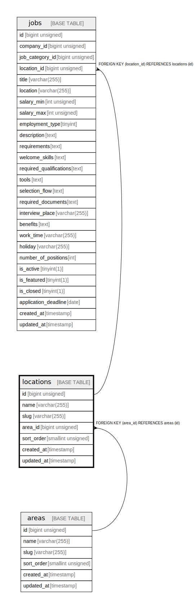

# locations

## Description

<details>
<summary><strong>Table Definition</strong></summary>

```sql
CREATE TABLE `locations` (
  `id` bigint unsigned NOT NULL AUTO_INCREMENT,
  `name` varchar(255) COLLATE utf8mb4_unicode_ci NOT NULL,
  `slug` varchar(255) COLLATE utf8mb4_unicode_ci NOT NULL,
  `area_id` bigint unsigned DEFAULT NULL,
  `sort_order` smallint unsigned NOT NULL DEFAULT '0',
  `created_at` timestamp NULL DEFAULT NULL,
  `updated_at` timestamp NULL DEFAULT NULL,
  PRIMARY KEY (`id`),
  UNIQUE KEY `locations_name_unique` (`name`),
  UNIQUE KEY `locations_slug_unique` (`slug`),
  KEY `locations_area_id_foreign` (`area_id`),
  CONSTRAINT `locations_area_id_foreign` FOREIGN KEY (`area_id`) REFERENCES `areas` (`id`) ON DELETE SET NULL
) ENGINE=InnoDB AUTO_INCREMENT=[Redacted by tbls] DEFAULT CHARSET=utf8mb4 COLLATE=utf8mb4_unicode_ci
```

</details>

## Columns

| Name | Type | Default | Nullable | Extra Definition | Children | Parents | Comment |
| ---- | ---- | ------- | -------- | ---------------- | -------- | ------- | ------- |
| id | bigint unsigned |  | false | auto_increment | [jobs](jobs.md) |  |  |
| name | varchar(255) |  | false |  |  |  |  |
| slug | varchar(255) |  | false |  |  |  |  |
| area_id | bigint unsigned |  | true |  |  | [areas](areas.md) |  |
| sort_order | smallint unsigned | 0 | false |  |  |  |  |
| created_at | timestamp |  | true |  |  |  |  |
| updated_at | timestamp |  | true |  |  |  |  |

## Constraints

| Name | Type | Definition |
| ---- | ---- | ---------- |
| locations_area_id_foreign | FOREIGN KEY | FOREIGN KEY (area_id) REFERENCES areas (id) |
| locations_name_unique | UNIQUE | UNIQUE KEY locations_name_unique (name) |
| locations_slug_unique | UNIQUE | UNIQUE KEY locations_slug_unique (slug) |
| PRIMARY | PRIMARY KEY | PRIMARY KEY (id) |

## Indexes

| Name | Definition |
| ---- | ---------- |
| locations_area_id_foreign | KEY locations_area_id_foreign (area_id) USING BTREE |
| PRIMARY | PRIMARY KEY (id) USING BTREE |
| locations_name_unique | UNIQUE KEY locations_name_unique (name) USING BTREE |
| locations_slug_unique | UNIQUE KEY locations_slug_unique (slug) USING BTREE |

## Relations



---

> Generated by [tbls](https://github.com/k1LoW/tbls)
