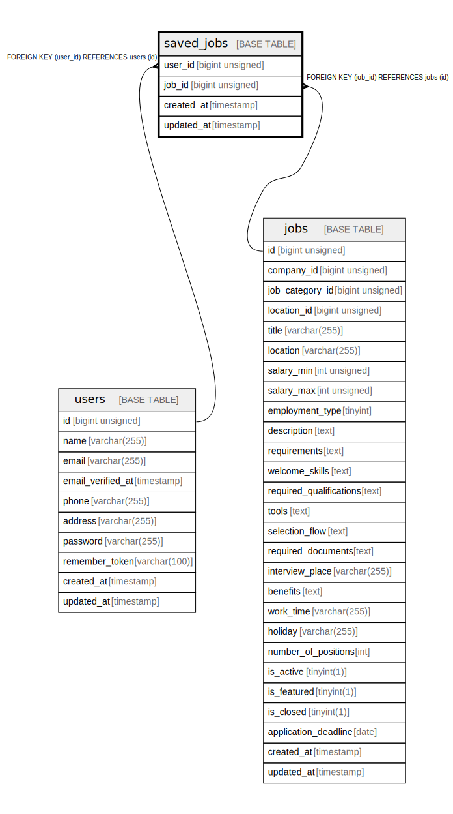

# saved_jobs

## Description

<details>
<summary><strong>Table Definition</strong></summary>

```sql
CREATE TABLE `saved_jobs` (
  `user_id` bigint unsigned NOT NULL,
  `job_id` bigint unsigned NOT NULL,
  `created_at` timestamp NULL DEFAULT NULL,
  `updated_at` timestamp NULL DEFAULT NULL,
  PRIMARY KEY (`user_id`,`job_id`),
  KEY `saved_jobs_job_id_foreign` (`job_id`),
  CONSTRAINT `saved_jobs_job_id_foreign` FOREIGN KEY (`job_id`) REFERENCES `jobs` (`id`) ON DELETE CASCADE,
  CONSTRAINT `saved_jobs_user_id_foreign` FOREIGN KEY (`user_id`) REFERENCES `users` (`id`) ON DELETE CASCADE
) ENGINE=InnoDB DEFAULT CHARSET=utf8mb4 COLLATE=utf8mb4_unicode_ci
```

</details>

## Columns

| Name | Type | Default | Nullable | Children | Parents | Comment |
| ---- | ---- | ------- | -------- | -------- | ------- | ------- |
| user_id | bigint unsigned |  | false |  | [users](users.md) |  |
| job_id | bigint unsigned |  | false |  | [jobs](jobs.md) |  |
| created_at | timestamp |  | true |  |  |  |
| updated_at | timestamp |  | true |  |  |  |

## Constraints

| Name | Type | Definition |
| ---- | ---- | ---------- |
| PRIMARY | PRIMARY KEY | PRIMARY KEY (user_id, job_id) |
| saved_jobs_job_id_foreign | FOREIGN KEY | FOREIGN KEY (job_id) REFERENCES jobs (id) |
| saved_jobs_user_id_foreign | FOREIGN KEY | FOREIGN KEY (user_id) REFERENCES users (id) |

## Indexes

| Name | Definition |
| ---- | ---------- |
| saved_jobs_job_id_foreign | KEY saved_jobs_job_id_foreign (job_id) USING BTREE |
| PRIMARY | PRIMARY KEY (user_id, job_id) USING BTREE |

## Relations



---

> Generated by [tbls](https://github.com/k1LoW/tbls)
