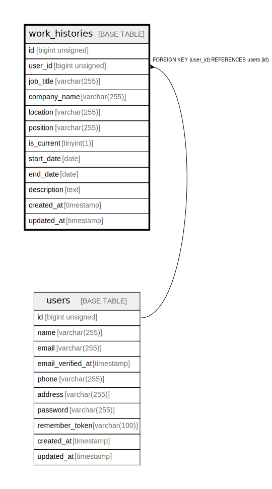

# work_histories

## Description

<details>
<summary><strong>Table Definition</strong></summary>

```sql
CREATE TABLE `work_histories` (
  `id` bigint unsigned NOT NULL AUTO_INCREMENT,
  `user_id` bigint unsigned NOT NULL,
  `job_title` varchar(255) COLLATE utf8mb4_unicode_ci DEFAULT NULL,
  `company_name` varchar(255) COLLATE utf8mb4_unicode_ci DEFAULT NULL,
  `location` varchar(255) COLLATE utf8mb4_unicode_ci DEFAULT NULL,
  `position` varchar(255) COLLATE utf8mb4_unicode_ci DEFAULT NULL,
  `is_current` tinyint(1) NOT NULL DEFAULT '0',
  `start_date` date DEFAULT NULL,
  `end_date` date DEFAULT NULL,
  `description` text COLLATE utf8mb4_unicode_ci,
  `created_at` timestamp NULL DEFAULT NULL,
  `updated_at` timestamp NULL DEFAULT NULL,
  PRIMARY KEY (`id`),
  KEY `work_histories_user_id_foreign` (`user_id`),
  CONSTRAINT `work_histories_user_id_foreign` FOREIGN KEY (`user_id`) REFERENCES `users` (`id`) ON DELETE CASCADE
) ENGINE=InnoDB AUTO_INCREMENT=[Redacted by tbls] DEFAULT CHARSET=utf8mb4 COLLATE=utf8mb4_unicode_ci
```

</details>

## Columns

| Name | Type | Default | Nullable | Extra Definition | Children | Parents | Comment |
| ---- | ---- | ------- | -------- | ---------------- | -------- | ------- | ------- |
| id | bigint unsigned |  | false | auto_increment |  |  |  |
| user_id | bigint unsigned |  | false |  |  | [users](users.md) |  |
| job_title | varchar(255) |  | true |  |  |  |  |
| company_name | varchar(255) |  | true |  |  |  |  |
| location | varchar(255) |  | true |  |  |  |  |
| position | varchar(255) |  | true |  |  |  |  |
| is_current | tinyint(1) | 0 | false |  |  |  |  |
| start_date | date |  | true |  |  |  |  |
| end_date | date |  | true |  |  |  |  |
| description | text |  | true |  |  |  |  |
| created_at | timestamp |  | true |  |  |  |  |
| updated_at | timestamp |  | true |  |  |  |  |

## Constraints

| Name | Type | Definition |
| ---- | ---- | ---------- |
| PRIMARY | PRIMARY KEY | PRIMARY KEY (id) |
| work_histories_user_id_foreign | FOREIGN KEY | FOREIGN KEY (user_id) REFERENCES users (id) |

## Indexes

| Name | Definition |
| ---- | ---------- |
| work_histories_user_id_foreign | KEY work_histories_user_id_foreign (user_id) USING BTREE |
| PRIMARY | PRIMARY KEY (id) USING BTREE |

## Relations



---

> Generated by [tbls](https://github.com/k1LoW/tbls)
