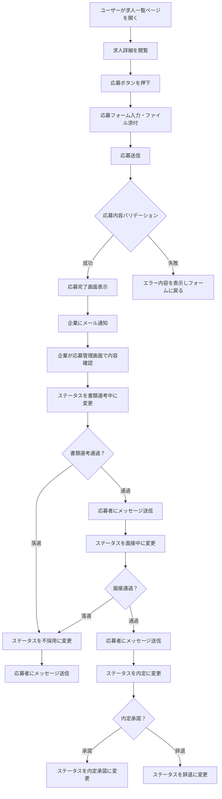

```mermaid
flowchart TD
    A[ユーザーが求人一覧ページを開く] --> B[求人詳細を閲覧]
    B --> C[応募ボタンを押下]
    C --> D[応募フォーム入力・ファイル添付]
    D --> E[応募送信]
    E --> F{応募内容バリデーション}
    F -- 成功 --> G[応募完了画面表示]
    F -- 失敗 --> H[エラー内容を表示しフォームに戻る]
    G --> I[企業にメール通知]
    I --> J[企業が応募管理画面で内容確認]
    J --> K[ステータスを書類選考中に変更]
    K --> L{書類選考通過？}
    L -- 通過 --> M[応募者にメッセージ送信]
    L -- 落選 --> N[ステータスを不採用に変更] --> O[応募者にメッセージ送信]
    M --> P[ステータスを面接中に変更]
    P --> Q{面接通過？}
    Q -- 通過 --> R[応募者にメッセージ送信]
    Q -- 落選 --> N
    R --> S[ステータスを内定に変更]
    S --> V{内定承諾？}
    V -- 承諾 --> W[ステータスを内定承諾に変更]
    V -- 辞退 --> X[ステータスを辞退に変更]
```